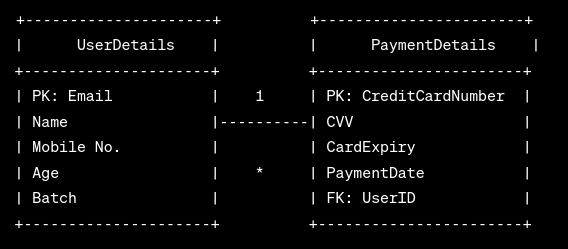

# Yoga Enrollment Form
https://frightened-wasp-robe.cyclic.app/enroll

## Steps to Run

- Clone this repo

- Make .env file with variables URI=<mongodb_url> & PORT=3000 

- RUN npm install 
 
- RUN node app.js

## Run With Docker

- Clone this repo

- Make .env file with variables URI=<mongodb_url> & PORT=3000 

- RUN docker build -t yoga_form .

- RUN docker container run -d yoga_form

## Database Design :
Used a MongoDB database to store User Data such as: 

### User Details
- Email (Primary Key)
- Name
- Mobile No.
- Age
- Batch

### Payment Details
- Credit Card Number
- CVV
- Card Expiry
- Payment Date

## ER Diagram

